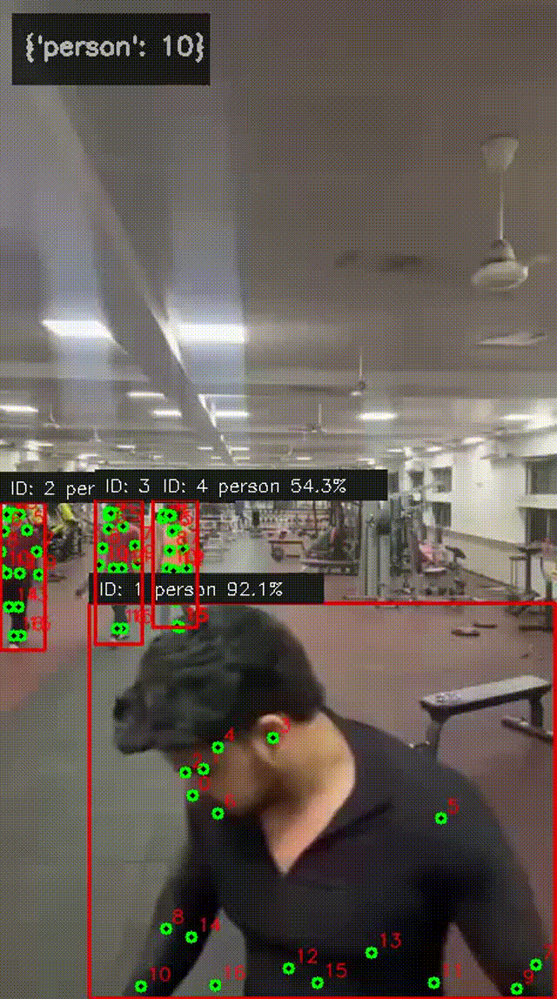

# StrongSORT YOLOv8 Multi-Object Tracking

## Output Demo


## What this does
- Real-time multi-object tracking using YOLOv8 + StrongSORT
- Tested on custom gym video
- Supports detection, segmentation and pose estimation

## How to Run
```bash
pip install ultralytics -U
python yolo_multi_model.py --source yourvideo.mp4 --track --count
```

## Observations
- Successfully tracked multiple persons with unique IDs
- Observed occlusion based ID switching when persons overlapped
- Same person got different ID after being hidden behind another person

## Tech Stack
- YOLOv8 for object detection
- StrongSORT for multi-object tracking
- Python, OpenCV, PyTorch
